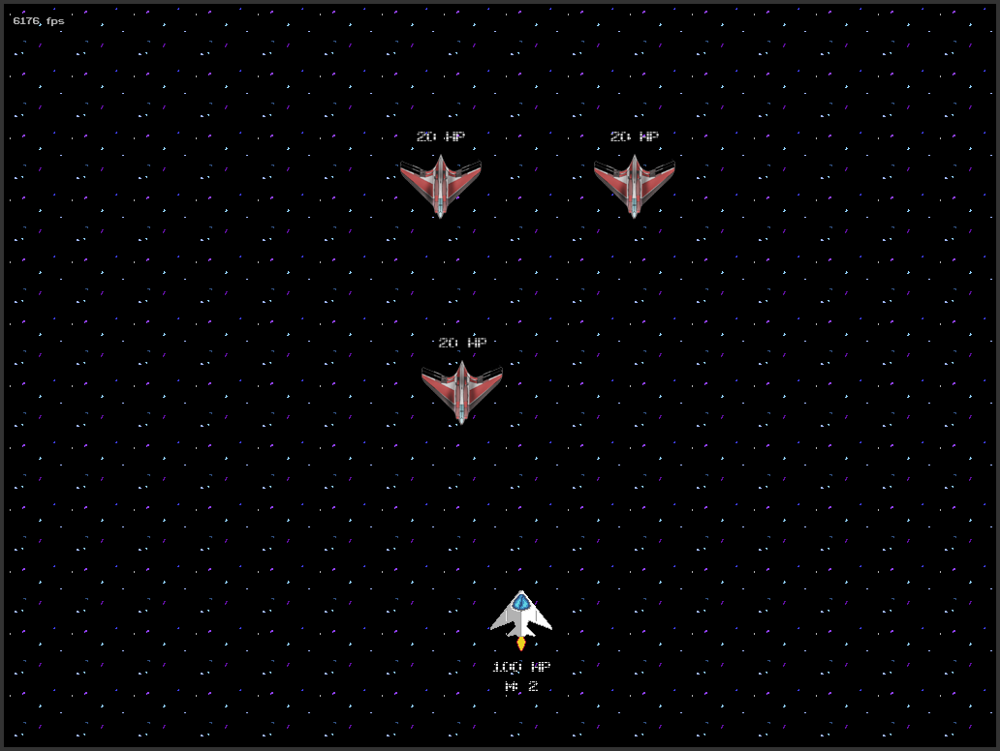

Crank
=====

I am writing this game while learning C++ gamedev using a book “SFML Game Development”.
So most of the code mimics the book samples but is adopted to my own needs as I progress
through the book chapters.

Book & Game progress:

* 01 Intro:         Base game loop with simple ship controls.
* 02 Resources:     ResourceManager, Loading textures & fonts.
* 03 World:         Scene management, SceneGraph, Entities, Sprites.
* 04 Input:         Commands, Events, Realtime Input.
* 05 States:        Game States, State Management etc.
* 06 Menus:         Base Gui, MenuState, Settings, Control bindings.
* 07 Gameplay:      Game Rules, Enemies, Projectiles, Collision Detection, Pickups, GameOver.

On the way:

* 08 Graphics:      To be reviewed.
* 09 Audio:         To be reviewed.
* 10 Network:       To be reviewed.
* 11 Production:    Make the finished & polished product.

# The Game

A man found himself awaked in a spaceship floating through deep space. He does not
remember anything before that moment. So you as a player should help him to find
out what the hell has happened.

# Useful links

* SFML Game Development Book Source Code (https://github.com/LaurentGomila/SFML-Game-Development-Book)
* SFML City Building Game Tutorial (https://www.binpress.com/tutorial/creating-a-city-building-game-with-sfml/137)
